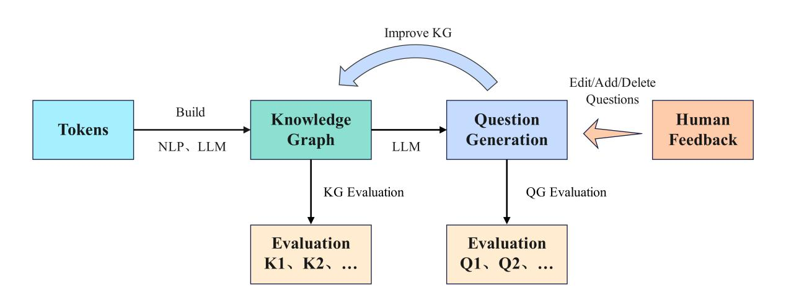

KG-QG Here you can INPUT a PDF to Generate questions.

KG-QG 图谱自进化带来的高质量问题生成

# 整个文章的pipeline如下：

## 🚩技术路线

1. 输入文本或其他文件能够转化为文本；
2. 使用NLP结合LLM技术从中提取实体、关系以构建知识图谱（对图谱质量进行评估K1）；
3. 基于图谱通过LLM技术生成问题并对问题质量进行评估（Q1）；
4. 之后引入了人工（本文用LLM替代人工改进）对问题进行编辑/修改/删除等；
5. 问题的修改记录返回知识图谱中实现图谱自进化，此时再次进行评估（K2）；
6. 评估后再次基于LLM生成题目再次对题目质量进行评估（Q2）……
7. 依次进行循环即可实现基于图谱自进化带来的问题生成。

**若Q2 > Q1且K2 > K1，那么可以认为图谱实现了自进化，并且进化后的图谱能够实现更高质量问题的生成。**

## 🐦‍🔥技术实现与代码对齐

【**代码位置：****[D:\\Desktop\\KG\_allprocess\\KG\_code](D:\Desktop\KG_allprocess\KG_code)**】

| 序号 |                对应功能                | 对应代码 |               输入/输出文件               |
| :----: | :--------------------------------------: | :--------: | :------------------------------------------: |
|  ①  |         PDF通过OCR技术提取文本         |     [Step1_pdf_to_text.py](file://D:\Desktop\KG_allprocess\KG_code\Step1_pdf_to_text.py)     |              输入：[第一讲.pdf](file://D:\Desktop\KG_allprocess\KG_files\第一讲.pdf) 输出：[第一讲_ocr.txt](file://D:\Desktop\KG_allprocess\KG_files\Output_files\Step1_output\第一讲_ocr.txt)               |
|  ②  | 对文本进行拆分便于下一步提取实体与关系 |     [Step2_ocr_text_to_sentences.py](file://D:\Desktop\KG_allprocess\KG_code\Step2_ocr_text_to_sentences.py)     |              输入：[第一讲_ocr.txt](file://D:\Desktop\KG_allprocess\KG_files\Output_files\Step1_output\第一讲_ocr.txt) 输出：[第一讲_句子列表.tsv](file://D:\Desktop\KG_allprocess\KG_files\Output_files\Step2_output\第一讲_句子列表.tsv)               |
|  ③  |         从文本中提取实体、关系         |  [Step3_extract_entities_simple.py](file://D:\Desktop\KG_allprocess\KG_code\Step3_extract_entities_simple.py)  [Step4_extract_relations_simple.py](file://D:\Desktop\KG_allprocess\KG_code\Step4_extract_relations_simple.py)   |     输入：[第一讲_句子列表.tsv](file://D:\Desktop\KG_allprocess\KG_files\Output_files\Step2_output\第一讲_句子列表.tsv) 输出：[第一讲_实体列表.tsv](file://D:\Desktop\KG_allprocess\KG_files\Output_files\Step3_output\第一讲_实体列表.tsv)  输入：[第一讲_实体列表.tsv](file://D:\Desktop\KG_allprocess\KG_files\Output_files\Step3_output\第一讲_实体列表.tsv) 输出：[第一讲_KG_edges.tsv](file://D:\Desktop\KG_allprocess\KG_files\Output_files\Step4_output\第一讲_KG_edges.tsv) [第一讲_KG_nodes.tsv](file://D:\Desktop\KG_allprocess\KG_files\Output_files\Step4_output\第一讲_KG_nodes.tsv)     |
|  ④  |            构建简单的KG图谱            |     [Step5_build_kg.py](file://D:\Desktop\KG_allprocess\KG_code\Step5_build_kg.py)     |                                            |
|  ⑤  |        导入neo4j里面进行可视化        |     [Step6_load_to_neo4j.py](file://D:\Desktop\KG_allprocess\KG_code\Step6_load_to_neo4j.py)     |            输入：[第一讲_KG_edges.tsv](file://D:\Desktop\KG_allprocess\KG_files\Output_files\Step4_output\第一讲_KG_edges.tsv) [第一讲_KG_nodes.tsv](file://D:\Desktop\KG_allprocess\KG_files\Output_files\Step4_output\第一讲_KG_nodes.tsv) 输出：none            |
|  ⑥  |        对知识图谱进行质量评估K1        |     [Step7_evaluate_kg.py](file://D:\Desktop\KG_allprocess\KG_code\Step7_evaluate_kg.py)     |             输入：[第一讲_KG_edges.tsv](file://D:\Desktop\KG_allprocess\KG_files\Output_files\Step4_output\第一讲_KG_edges.tsv) [第一讲_KG_nodes.tsv](file://D:\Desktop\KG_allprocess\KG_files\Output_files\Step4_output\第一讲_KG_nodes.tsv) 输出：[KG_quality_evaluation.csv](file://D:\Desktop\KG_allprocess\KG_files\Output_files\Step7_output\KG_quality_evaluation.csv) [KG_quality_evaluation.json](file://D:\Desktop\KG_allprocess\KG_files\Output_files\Step7_output\KG_quality_evaluation.json)             |
|  ⑦  |   结合LLM生成问题并对问题进行评估Q1   |  [Step8_generate_questions_simple.py](file://D:\Desktop\KG_allprocess\KG_code\Step8_generate_questions_simple.py)  [Step9_evaluate_questions.py](file://D:\Desktop\KG_allprocess\KG_code\Step9_evaluate_questions.py)   |  输入：[第一讲_KG_edges.tsv](file://D:\Desktop\KG_allprocess\KG_files\Output_files\Step4_output\第一讲_KG_edges.tsv) [第一讲_KG_nodes.tsv](file://D:\Desktop\KG_allprocess\KG_files\Output_files\Step4_output\第一讲_KG_nodes.tsv) [第一讲_句子列表.tsv](file://D:\Desktop\KG_allprocess\KG_files\Output_files\Step2_output\第一讲_句子列表.tsv) [prompt.txt](file://D:\Desktop\KG_allprocess\KG_code\prompt.txt) 输出：[第一讲_MCQ.tsv](assets/第一讲_MCQ-20251215210553-o7zf9la.tsv)  输入：[第一讲_MCQ.tsv](assets/第一讲_MCQ-20251215210553-o7zf9la.tsv) 输出：[第一讲_MCQ_eval.tsv](file://D:\Desktop\KG_allprocess\KG_files\Output_files\Step9_output\第一讲_MCQ_eval.tsv)   |
|  ⑧  |      结合LLM对问题进行修改 Change      |     [Step10_edit_questions.py](file://D:\Desktop\KG_allprocess\KG_code\Step10_edit_questions.py)     |               输入：[第一讲_MCQ_auto_revised.tsv](assets/第一讲_MCQ_auto_revised-20251215210640-79zh7n4.tsv) 输出：[第一讲_MCQ_auto_revised.tsv](assets/第一讲_MCQ_auto_revised-20251215210640-79zh7n4.tsv)               |
|  ⑨  |             对修改进行保存             |     [Step11_generate_kg_update_suggestions.py](file://D:\Desktop\KG_allprocess\KG_code\Step11_generate_kg_update_suggestions.py)     |            输入：[第一讲_KG_edges.tsv](file://D:\Desktop\KG_allprocess\KG_files\Output_files\Step4_output\第一讲_KG_edges.tsv) [第一讲_KG_nodes.tsv](file://D:\Desktop\KG_allprocess\KG_files\Output_files\Step4_output\第一讲_KG_nodes.tsv) [第一讲_MCQ_auto_revised.tsv](assets/第一讲_MCQ_auto_revised-20251215210640-79zh7n4.tsv) 输出：[第一讲_KG_update_suggestions.tsv](assets/第一讲_KG_update_suggestions-20251215210832-ntacw31.tsv)             |
|  ⑩  |      基于保存的修改反馈给知识图谱      |     [Step12_apply_kg_updates.py](file://D:\Desktop\KG_allprocess\KG_code\Step12_apply_kg_updates.py)     |           输入：[第一讲_KG_edges.tsv](file://D:\Desktop\KG_allprocess\KG_files\Output_files\Step4_output\第一讲_KG_edges.tsv) [第一讲_KG_nodes.tsv](file://D:\Desktop\KG_allprocess\KG_files\Output_files\Step4_output\第一讲_KG_nodes.tsv) [第一讲_KG_update_suggestions.tsv](assets/第一讲_KG_update_suggestions-20251215210832-ntacw31.tsv) 输出：[第一讲_KG_edges_updated.tsv](file://D:\Desktop\KG_allprocess\KG_files\Output_files\Step12_output\第一讲_KG_edges_updated.tsv) [第一讲_KG_nodes_updated.tsv](file://D:\Desktop\KG_allprocess\KG_files\Output_files\Step12_output\第一讲_KG_nodes_updated.tsv)            |
|      |  之后重复⑥、⑦即可，只需注意替换路径  |          | 用第⑩步的输出文件替换第⑥、⑦步的输入文件 |

搭建一整个自动化流程以用来生成数据进行测试。

【**自动化脚本的位置：**[pipeline_config.py](file://D:\Desktop\KG_allprocess\KG_tools\pipeline_config.py)    [run_batch.py](file://D:\Desktop\KG_allprocess\KG_tools\run_batch.py)    [run_pipeline.py](file://D:\Desktop\KG_allprocess\KG_tools\run_pipeline.py)】（运行时直接运行 [./](file:///D:/Desktop/KG_allprocess/KG_tools/run_batch.py)[run_batch.py](file://D:\Desktop\KG_allprocess\KG_tools\run_batch.py)  即可）

GitHub代码地址：[https://github.com/undoubtable/KG_allprocess.git](https://github.com/undoubtable/KG_allprocess.git)

主要文件夹位置：[KG_tools](file://D:\Desktop\KG_allprocess\KG_tools)     [Output](file://D:\Desktop\KG_allprocess\Output)     [PDF_files](file://D:\Desktop\KG_allprocess\PDF_files)

## 👺需要进一步的改进：

- [ ] 知识图谱的改进；

  之前不是提取了文中的实体与关系嘛，那么这些是否真的准确呢？

  实体目前来看是比较准确的，实体之间的关系判断可以借助LLM进一步优化。
- [ ] 图谱质量的评估标准，每一条都使其可以量化；
- [ ] 问题质量的评估标准，每一条都使其可以量化；
- [ ] 之后可以尝试修改提示词进一步提升性能。

