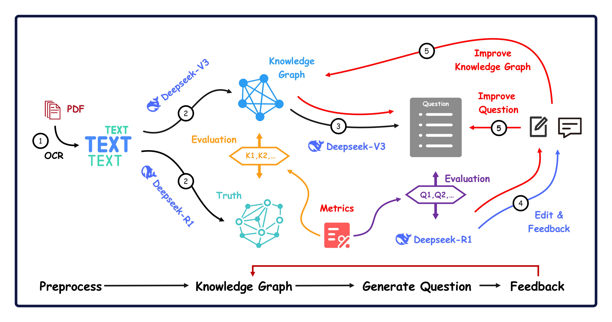

[](https://github.com/bjzgcai)

# SEKG-QG 一种基于反馈驱动演化的知识图谱自进化框架

Here you can INPUT a PDF to Generate questions.

SEKG-QG 基于反馈的图谱自进化带来的高质量问题生成，目前只是一个想法还不够完善，欢迎各位提出意见。

# Title : A Framework for Self-evolution of Knowledge Graphs Based on Feedback Driven Evolution

**中文版文章位置：[SEKG-QG_Paper/KG_QG_Chinese.pdf](/SEKG-QG_Paper/KG_QG_Chinese.pdf)**

**英文版文章位置：[SEKG-QG_Paper/KG_QG_version0.pdf](/SEKG-QG_Paper/KG_QG_version0.pdf)**


基于反馈驱动的SEKG-QG框架的技术路线图。
  系统从 PDF 文档中抽取文本段落，结合DeepSeek-V3大模型构建初始知识图谱。进一步使用更强的大模型（DeepSeek-R1）构建高置信参考知识图谱结合指标对初始图谱进行评估。随后基于初始知识图谱生成初始问题，并经过 DeepSeek-R1 结合指标进行质量评估，同时得到对初始问题的修改和反馈。最后这些修改和反馈反过来修正知识图谱，形成迭代闭环，使知识图谱与生成题目的质量能够协同提升（注意：序号表示框架执行的顺序，迭代闭环结构参见图 1 中红色箭头与紫色评估双向箭头的结合，顺序依次是序号3、紫色评估双向箭头、序号4、序号5，然后再次从序号3执行，开启新一轮的迭代）。


## 🚩 技术路线

1. 输入文本或其他文件能够转化为文本；
2. 使用NLP结合LLM技术从中提取实体、关系以构建知识图谱（对图谱质量进行评估K1）；
3. 基于图谱通过LLM技术生成问题并对问题质量进行评估（Q1）；
4. 之后引入了人工（本文用LLM替代人工改进）对问题进行编辑/修改/删除等；
5. 问题的修改记录返回知识图谱中实现图谱自进化，此时再次进行评估（K2）；
6. 评估后再次基于LLM生成题目再次对题目质量进行评估（Q2）……
7. 依次进行循环即可实现基于图谱自进化带来的问题生成。

**若Q2 > Q1且K2 > K1，那么可以认为图谱实现了自进化，并且进化后的图谱能够实现更高质量问题的生成。**

## 🚩 详细的技术路线如下：
1、从PDF中提取对应的文字段落；（目前实现的是中文的部分）

2、基于得到的文本段落提取出实体；（目前还没结合LLM可以结合LLM进行提取，预计使用 *<u>**DeepSeek-v3**</u>* ）

3、实体之间的关系进一步提升；（目前的关系仍然较为简单，可以使用LLM尝试去理解实体并得到之间的关系）

4、现在得到了实体和关系于是就可以进行绘图形成 *<u>**KG-version1**</u>* ；

5、上述得到的是测试提取的实体和关系，接下来要用更强的LLM抽取实体和关系，预期会得到一个更大更精确的 *<u>**KG-version-truth**</u>* 绘图对比；

6、结合 *<u>**KG-version-truth**</u>* 对 *<u>**KG-version1**</u>* 通过一下指标对其进行打分 *<u>**K-version1**</u>* ：

- 实体覆盖度100%；
- 关系覆盖度100%；
- 实体关系正确率100%；
- 正确的实体和边分别在 *<u>**KG-version-truth**</u>* 的占比100%；

7、现在已有 *<u>**KG-version1**</u>* ，下一步就是结合原来的文本段落使用LLM生成题目 ***<u>QG-version1</u>*** ；（这里不需要用到很强的模型，依旧可以采用前文的 *<u>**Deepseek-v3**</u>* ）；

8、生成的题目保存下来，交由更强的模型（ ***<u>DeepSeek-R1</u>*** ）对其进行检查对其进行打分 *<u>**Q-version1**</u>* ：

- 一套题问题的题干和选项中包含的实体与考察关系的个数（这个包含的实体和关系的个数可以通过一套题依据分布进行打分100%）；
- 一套题的问题与选项的语义连贯性（可以让 ***<u>DeepSeek-R1</u>*** 给出一个连贯的分数转为百分比100%）；
- 一套题的题干与选项中的实体对应正确率100%；
- 一套题的选项中正确答案中实体之间的关系正确率100%；

9、随后使用更强的模型（ ***<u>DeepSeek-R1</u>*** ）对生成的题目 ***<u>QG-version1</u>***<span data-type="text" style="color: var(--b3-card-info-color);"> </span>给出一些修改得到 ***<u>QG-version2</u>*** ，修改的建议作为人工反馈 ***<u>Feedback</u>*** ；

10、上述的 ***<u>Feedback</u>*** 退回给 *<u>**KG-version1**</u>* 对其进行修改得到 *<u>**KG-version2**</u>* ，并使用 *<u>**KG-version-truth**</u>* 对 *<u>**KG-version2**</u>* 进行评估得到 *<u>**K-version2**</u>*；

11、比对 *<u>**K-version2**</u>* 与 *<u>**K-version1**</u>* 看是否提高与提高的幅度；

12、随后基于 *<u>**KG-version2**</u>* 结合结合原来的文本段落使用LLM生成题目 ***<u>QG-version2</u>*** 依旧是使用原模型和原提示词；

13、生成的题目保存下来，交由更强的模型（ ***<u>DeepSeek-R1</u>*** ）对其进行检查对其进行打分 *<u>**Q-version2**</u>* ；

14、比对 *<u>**Q-version2**</u>* 和 *<u>**Q-version1**</u>* 看是否提高；

15、最终批量化进行作业得到提高与提高多少的结论。


## 🐦‍🔥技术实现与代码对齐

【**代码位置：[KG\_allprocess\\KG\_tools](/KG_tools)**】

| 序号 |                对应功能                | 对应代码 |               输入/输出文件               |
| :----: | :--------------------------------------: | :--------: | :------------------------------------------: |
|  ①  |         PDF通过OCR技术提取文本         |     [Step1_pdf_to_text.py](KG_tools/Step1_pdf_to_text.py)     |              输入：[第一讲.pdf](KG_files/第一讲.pdf)<br />输出：[第一讲_ocr.txt](Output/Step1_output/第一讲_ocr.txt)<br />              |
|  ②  | 对文本进行拆分便于下一步提取实体与关系 |     [Step2_ocr_text_to_sentences.py](/KG_tools/Step2_ocr_text_to_sentences.py)     |              输入：[第一讲_ocr.txt](Output/Step1_output/第一讲_ocr.txt)<br />输出：[第一讲_句子列表.tsv](Output/Step2_output/第一讲_句子列表.tsv)<br />              |
|  ③  |         从文本中提取实体、关系         |  [Step3_extract_entities_simple.py](KG_tools/Step3_extract_entities_simple.py)<br /><br />[Step4_extract_relations_simple.py](KG_tools/Step4_extract_relations_simple.py)<br />  |     输入：[第一讲_句子列表.tsv](Output/Step2_output/第一讲_句子列表.tsv)<br />输出：[第一讲_实体列表.tsv](Output/Step3_output/第一讲_实体列表.tsv)<br /><br />输入：[第一讲_实体列表.tsv](KG_tools/Output_files/Step3_output/第一讲_实体列表.tsv)<br />输出：[第一讲_KG_edges.tsv](Output/Step4_output/第一讲_KG_edges.tsv)<br />[第一讲_KG_nodes.tsv](Output/Step4_output/第一讲_KG_nodes.tsv)     |
|  ④  |            构建简单的KG图谱            |     [Step5_build_kg.py](KG_tools/Step5_build_kg.py)     |                                            |
|  ⑤  |        导入neo4j里面进行可视化        |     [Step6_load_to_neo4j.py](KG_tools/Step6_load_to_neo4j.py)     |            输入：[第一讲_KG_edges.tsv](Output/Step4_output/第一讲_KG_edges.tsv)<br />[第一讲_KG_nodes.tsv](Output/Step4_output/第一讲_KG_nodes.tsv)<br />输出：none            |
|  ⑥  |        对知识图谱进行质量评估K1        |     [Step7_evaluate_kg.py](KG_tools/Step7_evaluate_kg.py)     |             输入：[第一讲_KG_edges.tsv](Output/Step4_output/第一讲_KG_edges.tsv)<br />[第一讲_KG_nodes.tsv](Output/Step4_output/第一讲_KG_nodes.tsv)<br />输出：[KG_quality_evaluation.csv](Output/Step7_output/KG_quality_evaluation.csv)<br />[第一讲_KG_quality.json](Output/Step7_output/第一讲_KG_quality.json)             |
|  ⑦  |   结合LLM生成问题并对问题进行评估Q1   |  [Step8_generate_questions_simple.py](KG_tools/Step8_generate_questions_simple.py)<br /><br />[Step9_evaluate_questions.py](KG_tools/Step9_evaluate_questions.py)<br />  |  输入：[第一讲_KG_edges.tsv](Output/Step4_output/第一讲_KG_edges.tsv)<br />[第一讲_KG_nodes.tsv](Output/Step4_output/第一讲_KG_nodes.tsv)<br />[第一讲_句子列表.tsv](Output/Step2_output/第一讲_句子列表.tsv)<br />[prompt.txt](KG_tools/prompt.txt)<br />输出：[第一讲_MCQ.tsv](/Output/Step8_output/第一讲_MCQ.tsv)<br /><br />输入：[第一讲_MCQ.tsv](/Output/Step8_output/第一讲_MCQ.tsv)<br />输出：[第一讲_MCQ_eval.tsv](Output/Step9_output/第一讲_MCQ_eval.tsv)<br />  |
|  ⑧  |      结合LLM对问题进行修改 Change      |     [Step10_edit_questions.py](KG_tools/Step10_edit_questions.py)     |               输入：[第一讲_MCQ_auto_revised.tsv](/Output/Step9_output/第一讲_MCQ_eval.tsv)<br />输出：[第一讲_MCQ_auto_revised.tsv](/Output/Step10_output/第一讲_MCQ_auto_revised.tsv)               |
|  ⑨  |             对修改进行保存             |     [Step11_generate_kg_update_suggestions.py](KG_tools/Step11_generate_kg_update_suggestions.py)     |            输入：[第一讲_KG_edges.tsv](Output/Step4_output/第一讲_KG_edges.tsv)<br />[第一讲_KG_nodes.tsv](Output/Step4_output/第一讲_KG_nodes.tsv)<br />[第一讲_MCQ_auto_revised.tsv](/Output/Step10_output/第一讲_MCQ_auto_revised.tsv)<br />输出：[第一讲_KG_update_suggestions.tsv](/Output/Step11_output/第一讲_KG_update_suggestions.tsv)<br />            |
|  ⑩  |      基于保存的修改反馈给知识图谱      |     [Step12_apply_kg_updates.py](KG_tools/Step12_apply_kg_updates.py)     |           输入：[第一讲_KG_edges.tsv](Output/Step4_output/第一讲_KG_edges.tsv)<br />[第一讲_KG_nodes.tsv](Output/Step4_output/第一讲_KG_nodes.tsv)<br />[第一讲_KG_update_suggestions.tsv](/Output/Step11_output/第一讲_KG_update_suggestions.tsv)<br />输出：[第一讲_KG_edges_updated.tsv](/Output/Step12_output/第一讲_KG_edges_updated.tsv)<br />[第一讲_KG_nodes_updated.tsv](Output/Step12_output/第一讲_KG_nodes_updated.tsv)<br />           |
|      |  之后重复⑥、⑦即可，只需注意替换路径  |          | 用第⑩步的输出文件替换第⑥、⑦步的输入文件 |


> [!IMPORTANT]
> **我们也搭建一整个自动化流程以用来生成数据进行测试。**
>
> 【**自动化脚本的位置：**[pipeline_config.py](/KG_tools/pipeline_config.py)    [run_batch.py](/KG_tools/run_batch.py)    [run_pipeline.py](/KG_tools/run_pipeline.py)】（运行时直接运行 [./run_batch.py](/KG_tools/run_batch.py)  即可）


GitHub代码地址：[https://github.com/undoubtable/KG_allprocess.git](https://github.com/undoubtable/KG_allprocess.git)

主要文件夹位置：

[KG_tools](/KG_tools)               Here, you can run the auto code.

[Output](/Output)                   Here, you can see what you output.

[PDF_files](/PDF_files)             Here, you can inpput your PDF files.

## **环境要求**

- **Python**: 建议使用 `Python 3.8+`。
- **虚拟环境（推荐）**: 使用 `venv` 或 `conda` 创建隔离环境：

```powershell
python -m venv .venv
# 激活（PowerShell）
.\.venv\Scripts\Activate.ps1
pip install -U pip
```

- **依赖安装**: 如果仓库中存在 `requirements.txt`（或 `KG_tools/requirements.txt`），运行：

```bash
pip install -r requirements.txt
# 或
pip install -r KG_tools/requirements.txt
```

- **OCR 与外部工具**: 若使用 OCR（`pytesseract`），需在系统中安装 Tesseract OCR 并将其可执行文件路径加入 `PATH`；Windows 可参考 Tesseract 官方安装包。
- **Neo4j**: 若要将图谱加载到 Neo4j，请安装并启动 Neo4j（社区版即可），并在 `KG_tools/Step6_load_to_neo4j.py` 中配置连接信息（host/username/password 或使用环境变量）。

## **如何运行**

- **一键运行（自动化流水线）**: 仓库提供自动化脚本，可运行完整流程或批量任务：

```bash
# 运行单次流水线
python KG_tools/run_pipeline.py

# 批量处理（按配置批量运行）
python KG_tools/run_batch.py
```

- **按步骤运行（调试/开发）**: 可单独运行各步骤脚本以便调试或逐步执行：

```bash
python KG_tools/Step1_pdf_to_text.py   # PDF -> 文本（OCR）
python KG_tools/Step2_ocr_text_to_sentences.py
python KG_tools/Step3_extract_entities_simple.py
python KG_tools/Step4_extract_relations_simple.py
python KG_tools/Step5_build_kg.py
python KG_tools/Step6_load_to_neo4j.py
python KG_tools/Step7_evaluate_kg.py
python KG_tools/Step8_generate_questions_simple.py
```

- **模型/凭证配置**: 如果流程中使用外部大模型或云服务，请在 `KG_tools/config.yaml` 中填写相应的凭证与模型配置，或将凭证设置为环境变量（例如 `OPENAI_API_KEY` 或其他服务的 API_KEY）。

- **示例数据位置**: 输入 PDF 放在 `PDF_files/`，生成与中间输出文件位于 `Output/` 目录下（详见上方表格）。
